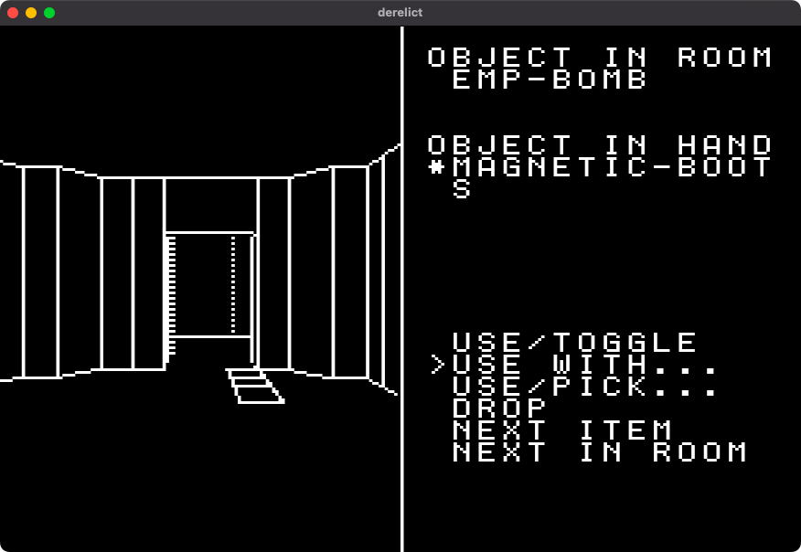
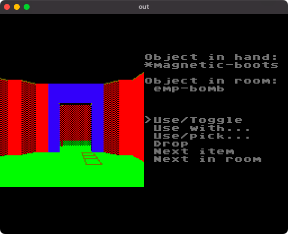
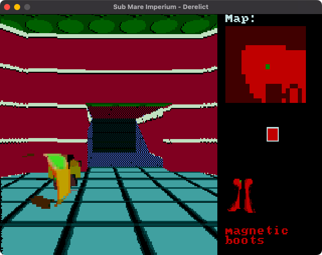
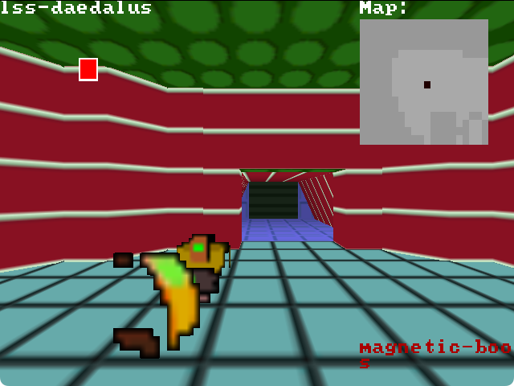
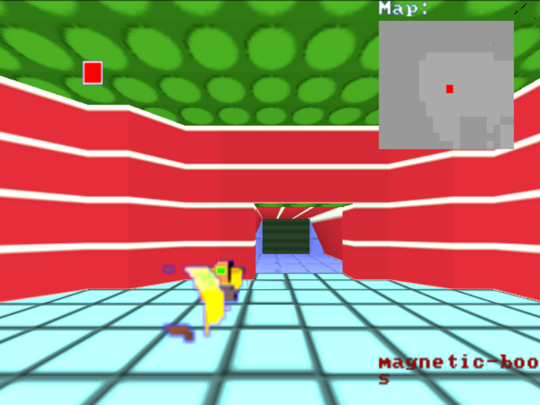

# Sub Mare Imperium: Derelict
A 3D turn based adventure for various platforms; you're a hacker with a simple mission (Remake of a remake of a remake of a remake)

 - [coverage report](https://thefakemontyontherun.github.io/space-trashman-blues/coverage/index.html)

[Read the docs](https://thefakemontyontherun.github.io/space-trashman-blues/) for more info on the tech and the status of the project!

MY frontend - Derelict 8-bit (Sega Master System, MSX, IBM PC 5150 and Amstrad CPC 464+)

Download link: https://montyontherun.itch.io/sub-mare-imperium-derelict-8-bit

MZ frontend - Derelict 16-bit (Sega Mega Drive/Genesis, Amiga OCS, Atari ST and IBM PC 286 with EGA)

Download link: https://montyontherun.itch.io/sub-mare-imperium-derelict-16-bits

MX frontend - Derelict 32-bit (MS-DOS/FreeDOS 386+, Macintosh classic, Mac OS X (PPC/Intel/ARM), Windows 95+, Linux, Android, Amiga AGA, Gameboy Advanced and HTML5)

Download link: https://montyontherun.itch.io/sub-mare-imperium-derelict-32-bit

GL frontend - Derelict 64-bit (Nintendo 64, Nintendo DS, Linux, NetBSD, Mac OSX (PPC/Intel/ARM) - even 32-bit variants!)

Download link: https://montyontherun.itch.io/sub-mare-imperium-derelict-64

EE frontend - Derelict 128-bit (Sony Playstation 2)

Download link: https://montyontherun.itch.io/derelict-128

